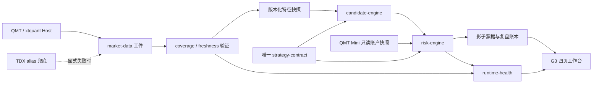

# AiStock 重建实施方案（2026-07-26）

## 目标与非目标

目标是在不扩大交易风险的前提下，将 AiStock 重建为一个由 QMT 主数据、单一 G3 正式合同、可验证数据闭环、单一调度 owner 和四页交易工作台组成的系统。

本方案不做三件事：不整体重写、不在重建期间开启真实下单、不把 TDX 删除或提升为主源。TDX 仅保留为 QMT canonical code 的显式、可审计 alias 取数兜底。

## 不可违反的护栏

- `auto_order_allowed=false`、`formal_buy_signal=false`、`order_path_enabled=false` 必须持续成立，直到用户明确批准正式交易启用。
- QMT/xtquant 只能在 Windows Host 运行；Docker 只消费落地工件，不直接导入 `xtquant`。
- 持仓/资金正式同步仅在每个交易日收盘后 17:30 自动执行；盘中只能手动刷新。
- 日线和分钟线只用真实数据修复；空响应或填充 OHLC 不能被当成覆盖已闭环。
- 每项工件只能有一个生产者、一个最终验证器和一个修复 owner。
- 所有新建或改写的项目文件使用 UTF-8 与 LF；不触碰未跟踪的本地 `Libs/` 运行时。

## 目标架构

## P0：可信安全闭环（先实施）

| 工作包 | 实施内容 | 产物 | 验收 |
|---|---|---|---|
| P0.1 合同冻结 | 对比当前 runtime 合同、策略手册和页面显示；消除 `g3_final...` 与 `g3_mainwave_continuation...`、Score120/88、10%/12% 等冲突，只保留一个权威合同 | `strategy_contract.json`、版本号、迁移说明 | 影子、回测、风险、页面读取同一 version/hash；冲突字段为 0 |
| P0.2 健康发布重建 | 将健康发布改为有超时、锁、结构化结果和原子快照的单次任务；识别并清除旧卡死实例后再注册唯一任务 | `health/latest.json`、`health/latest_run.json` | 连续运行三次均在时限内结束；过期快照必定阻断策略 |
| P0.3 数据覆盖真相 | 以 coverage report 为唯一闭环证据；将上市/退市、QMT 空响应、写库失败、待人工确认分型 | `daily_kline_coverage/latest.json`、豁免清单、失败清单 | `status=healthy`，或所有残余均有正式业务确认；禁止用任务退出码替代报告 |
| P0.4 调度去重 | 列出 Windows Task Scheduler 与 APScheduler 的所有生产者；暂停/迁移重复 owner，保留 Host QMT 采集和后端只读消费 | `runtime_orchestration_manifest.json` | 任一工件只有一个生产者；G2 调度不再随正式后端启动 |
| P0.5 质量门禁 | 修复 pytest 失败、项目自有乱码、问号占位与扫描范围；新增 P0 回归测试 | 测试报告、编码报告 | pytest 全绿；编码守卫仅扫描受控源码；前端构建通过 |

### P0 顺序与回滚

1. 先只读抓取基线和备份任务定义/工件。
2. 冻结合同和订单护栏，再处理健康发布。
3. 处理 coverage 分型与修复，不修改历史交易事实。
4. 最后切换调度 owner 并跑完整质量门禁。

每个工作包独立提交、独立验证。任何失败都回滚到前一个任务定义或代码版本；订单护栏不参与回滚，始终保持关闭。

## P1：核心域收敛

| 目标域 | 从现状迁出 | 新边界 |
|---|---|---|
| `market_data` | 数据源选择、QMT/TDX alias、coverage、特征输入 | 只产生真实、版本化数据工件 |
| `strategy_contract` | G3 合同、版本、迁移与校验 | 纯数据和纯校验，无 API/调度副作用 |
| `candidate_engine` | 候选池、30m 确认、路由、票据 | 输入固定快照，输出可追溯候选 |
| `risk_engine` | 仓位、止损、现金、账户风险门槛 | 无订单能力，只给出允许/阻断和原因 |
| `broker_read_model` | QMT Mini 只读资金、持仓、成交 | Host 采集，Docker 仅读工件 |
| `runtime_orchestrator` | 任务清单、依赖、健康、恢复归属 | 只编排和发布状态，不实现业务规则 |

迁移策略是“绞杀式替换”：先从超大 API 中提取纯函数并用测试锁定，再让旧路由调用新域服务；稳定后才删除旧调用。不得在一次改动中同时改数据口径、交易规则和页面。

## P2：研究、页面与归档

1. 为所有脚本建立注册表：`formal`、`research_only`、`historical`、`retire`；只有 `formal` 能由调度器调用。
2. G3 正式导航固定为工作台、有效性诊断、历史成交/逐日复盘、风控合同；Gen2 保留深链和只读研究页，移除正式导航与启动调度。
3. 每次回测记录数据版本、合同 hash、成本/滑点、样本内/样本外、交易数、集中度和失败样本。
4. 输出一份运行手册：异常分级、唯一修复 owner、人工确认点、回滚步骤和通知规则。

## 验收门槛

| 关卡 | 进入条件 | 放行条件 |
|---|---|---|
| P0 Gate | 订单护栏关闭、基线工件已保存 | 健康连续更新、数据闭环、测试全绿、调度 owner 唯一 |
| P1 Gate | P0 全部通过 | 任意影子票据可追溯数据→特征→合同→风控→账户快照 |
| P2 Gate | P1 全部通过 | 研究不能触发正式路径；G3 四页与合同/账本事实一致 |
| 正式交易 Gate | 用户单独授权 | 另行完成纸面复现、订单幂等、券商回报对账和人工复核；不属于本次重建自动范围 |

## 实施节奏

- 第 1 轮：P0.1、P0.2，先取得合同和健康状态的唯一真相。
- 第 2 轮：P0.3、P0.4，消除数据与调度的假成功。
- 第 3 轮：P0.5，建立能阻止回归的质量门禁。
- 第 4 至 6 轮：按六个域逐一完成 P1。
- 最后：执行 P2 归档和界面收敛。

每轮结束只汇报：变更范围、验证证据、未闭环项、是否达到下一 Gate。未通过 Gate 时不扩展范围。

## P0 第一轮执行记录（2026-07-26 15:41 +08:00）

- 已完成 P0.2 的第一部分：健康发布器将 `blocked`/`degraded` 视为成功发布的安全状态，不再以非零退出码伪装为任务崩溃；计划任务已增加 2 分钟执行上限、`IgnoreNew` 单实例和异常重试。
- 已结束旧的卡死发布实例并重注册任务。新任务手动验证结果为 `LastTaskResult=0x00000000`，快照已更新至 `2026-07-26T15:41:38+08:00`，并正确保持 `status=blocked`、`strategy_actionable=false`。
- 已完成 P0.3 的健康语义修正：无进展循环会指向业务确认而不是无限重跑。当前报告尚未出现 `stop_continuous=true`，因此仍按有限修复链路处理；残余 `1302` 个 code-date / `334` 只不完整股票仍为未闭环事实。
- 已完成 P0.3 的未解决缺口台账：滚动状态升级为 schema 3，保留每只未解决证券的分类和业务确认标志。2026-07-26 的只读审计确认 334 只残余证券均有完整上市元数据、无退市元数据豁免；由于旧状态没有保留逐次 QMT 响应，当前统一标记为 `prior_unresolved_source_outcome_not_persisted`，全部需要一次可审计源确认后才能归类为源空、部分覆盖或真实可修复缺口。
- 已完成 P0.5 的首个质量门禁：全量 pytest `34 passed`，Python 编译与 PowerShell AST 均通过。
- 未完成：合同冻结、日线残余的业务确认/修复、G2 调度迁出、项目自有乱码全面清理。
